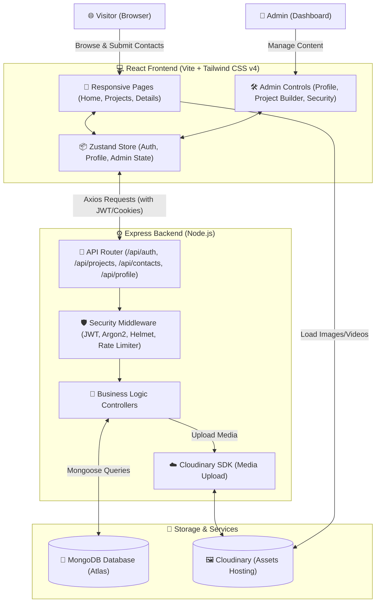

# 🚀 nagur.dev — MERN Developer Showcase (v2.5.0)

A premium, production-ready, full-stack developer portfolio and content management system (CMS) built with the MERN stack. Designed for recruiters and software engineering showcases, with a dynamic frontend, database-driven content, and a robust administrative control panel.

---

## 📊 System Architecture Flow

The flowchart below visualizes how the frontend, backend, database, and asset storage services interact to deliver a seamless visitor and administrator experience:



---

## 🌟 Key Features

### 🎨 Visitor Showcase Experience
- **✨ High-Fidelity UI/UX**: Fully animated layouts using `framer-motion` and styled with Tailwind CSS v4.
- **🌓 Adaptive Dark Theme**: Seamless dark/light mode toggle with persistent state saved in user configurations.
- **📁 Dynamic Projects Gallery**: Custom-grouped product layout showing title, tech stack chips, tags, and action links.
- **🔍 Engineering Case Studies**: Dynamic project detail pages offering:
  - **📐 Architecture Blocks**: Displays frontend, backend, database, and integration stacks.
  - **💡 Technical Decisions**: Rationale behind libraries and system design choices.
  - **🔧 Challenges & Solutions**: Actionable engineering problem-solving highlights.
  - **📊 Media Showcase**: Real-time rendering of looping preview videos, screenshots, or fallback graphics.
- **✉️ Secure Contact Form**: Real-time input handling, loading transitions, and success confirmation toasts.
- **🌐 Dynamic SEO Engine**: Automatic update of meta tags, page titles, and favicon based on route states.

### 🔐 Administrative Dashboard (`/admin`)
- **📈 Real-time Statistics**: Metrics summarizing project counts, new contact submissions, and profile statuses.
- **🛠️ Dynamic CMS Editor**: Update bio, developer tagline, social handles, custom background patterns, and system themes with strict validation limits.
- **📁 Project Builder**: Comprehensive project CRUD system with support for:
  - Image/Video upload through Multi-Part Forms (`multer` + Cloudinary).
  - Drag-and-drop or manual sequencing (`order` reordering).
- **💬 Inbox Management**: Review details of visitor inquiries, toggle read status, and delete messages.
- **🛡️ Security Console**: Dedicated password update terminal featuring validation checkers and robust credential constraints.

---

## 🔒 Security Implementation

- **🛡️ Secure Sessions**: JSON Web Tokens (JWT) stored in secure, `HttpOnly`, `SameSite=Lax` cookies.
- **🔑 Password Hashing**: Utilizes modern **Argon2** algorithm for state-of-the-art credential encryption.
- **🛸 Content Security Policy (CSP)**: Strict headers configured via `helmet` to permit only verified media and API source connections.
- **⏳ API Protection**: Configured rate limits (`express-rate-limit`) on sensitive authentication routes.
- **⚔️ Injection Defense**: Dynamic sanitation for incoming request parameters using `express-mongo-sanitize`, `xss-clean`, and `hpp` to mitigate NoSQL injection, XSS, and parameter pollution.

---

## 🚀 Running the Project

### Prerequisites
- Node.js (v18+)
- MongoDB connection string
- Cloudinary API keys (for media uploads)

### 1. Installation
Clone the repository and install all dependencies:
```bash
# Install root dependencies (Backend)
npm install

# Install frontend dependencies
npm install --prefix frontend
```

### 2. Environment Setup
Create a `.env` file in the root directory:
```env
PORT=5000
NODE_ENV=development
MONGODB_URI=your_mongodb_connection_uri
JWT_SECRET=your_jwt_signing_secret
COOKIE_SECRET=your_cookie_signing_secret

# Cloudinary Config
CLOUDINARY_CLOUD_NAME=your_cloud_name
CLOUDINARY_API_KEY=your_cloudinary_api_key
CLOUDINARY_API_SECRET=your_cloudinary_api_secret
```

### 3. Start Development Servers
```bash
# Start backend (using nodemon) and frontend dev server
npm run dev
```

---

## 🛠️ Stack Summary

| Layer | Technologies |
|---|---|
| **Frontend** | React, React Router Dom, Zustand, Framer Motion, Tailwind CSS v4, Axios |
| **Backend** | Node.js, Express.js, JWT, Argon2, Multer, Cloudinary SDK |
| **Database** | MongoDB (via Mongoose ODM) |
| **Styling** | Vanilla CSS + Tailwind CSS v4 |
| **Tooling** | Vite, Nodemon, ESLint |

---

## 🤝 Contributing

Contributions are welcome! Please open an issue first to discuss major alterations before submitting a Pull Request.

---

## 📄 License

This project is licensed under the [ISC License](LICENSE).
